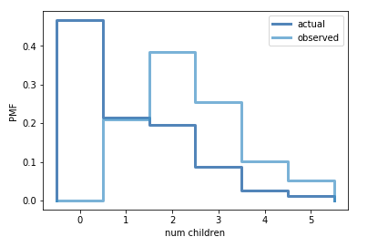

[Think Stats Chapter 3 Exercise 1](http://greenteapress.com/thinkstats2/html/thinkstats2004.html#toc31) (actual vs. biased)

#### Calculations
`PMF Mean = 1.024205`  
`Biased Mean = 2.403679`

### Charts



### Code
```
import numpy as np
import thinkstats2
import thinkplot
import nsfg

# access data
resp = nsfg.ReadFemResp()
num_child = resp['numkdhh']


def plotPMF(pmfs, xlabel, ylabel):
    if (len(pmfs)>1):
        thinkplot.PrePlot(len(pmfs))
        thinkplot.Pmfs(pmfs)
    else:
        thinkplot.Pmf(pmfs[0])
    thinkplot.Config(xlabel=xlabel,ylabel=ylabel)

def biasPMF(pmf, label):
    new_pmf = pmf.Copy(label=label)
    
    [new_pmf.Mult(x,x) for x,p in pmf.Items()]
    new_pmf.Normalize()
    return new_pmf

# plot actual pmf
pmf = thinkstats2.Pmf(num_child, label='actual')
plotPMF([pmf],'num children','PFM')

# plot actual and biased pmf
bias_pmf = biasPMF(pmf, label='observed')
plotPMF([pmf,bias_pmf],'num children','PMF')

# print means
print('pmf mean: %d  | biased mean: %d' % (pmf.Mean(),bias_pmf.Mean()))
```